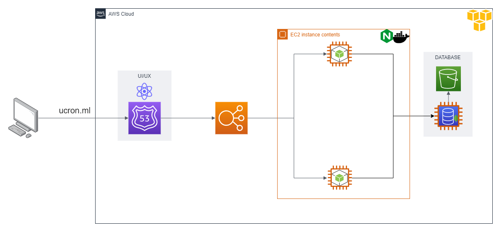

# Proyecto - Redes de computadoras 2
## Gurpo #8 Integrantes
| Nombre                                    | Carnet    |
|-------------------------------------------|-----------|
| Leonardo   Roney     Martínez  Maldonado  | 201780044 |
| Cesar      Leonel    Chamale   Sican      | 201700634 |
| Julio      Enrique   Wu        Chiu       | 201906180 |
| Marcos     Enrique   Curtidor  Sagui      | 201900874 |

## Arquitectura

Como solicitud de Ucron se hizo usó del dominio "ucron.ml", el cual se encuentra relacionado hacia la funcionabilidad Route53 que provee AWS para la administración de dominios y poder acceder al sitio mediante un nombre fácil de recordar, posteriormente se hace la petición hacia un balanceador de carga que realiza cada una de las peticiones hacia 2 instancias de EC2 en donde se encuentra desplegada todo lo necesario. 

Dentro de cada una de las instancias se encuentra desplegada una aplicación hecha con la biblioteca de ReactJS mediante el uso de NGINX y también un servidor realizado con NodeJS que se encuentra dentro de un contenedor de Docker para un buen rendimiento, dicho servidor se conectada hacia una base de datos NoSQL, MongoDB, en la cual se encuentra almacenado cada uno de los datos que visualizan los usuarios. Por petición de Ucron se creó un Bucket de S3 para almacenar las imágenes que se nos proporcionaron para que puedan ser mostradas en la interfaz.

Toda esta infraestructura se desplegó en el proveedor de la nube AWS debido a la gran cantidad de servicios que proveen y la forma en la que estos se relacionan entre sí.

## Route53

## Load Balancer

## Target Group

## Interfaz Página web

## Servidor

El servidor encargado de brindar los datos necesarios para ser utilizados en la aplicación web fue desarrollado con NodeJS, el cual se basa en la programación con el lenguaje de programación Javascript.

## Base de datos

Se utilizó la base de datos NoSQL, MongoDB, de tal forma que sea sencillo de registrar cada uno de los datos sin la necesidad de realizar consultas extensas que puedan afectar el rendimiento de toda la aplicación.