# Proyecto 1 Fase 2 - Redes de computadoras 2
## Gurpo #8 Integrantes
| Nombre                                    | Carnet    |
|-------------------------------------------|-----------|
| Leonardo   Roney     Martínez  Maldonado  | 201780044 |
| Cesar      Leonel    Chamale   Sican      | 201700634 |
| Julio      Enrique   Wu        Chiu       | 201906180 |
| Marcos     Enrique   Curtidor  Sagui      | 201900874 |

# Arquitectura
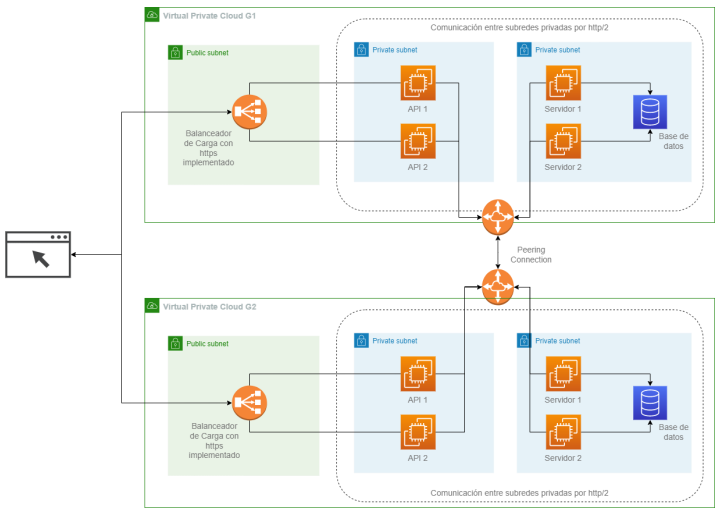
Como solicitud de Ucron se hizo usó del dominio "ucron.ml", el cual se encuentra relacionado hacia la funcionabilidad Route53 que provee AWS para la administración de dominios y poder acceder al sitio mediante un nombre fácil de recordar, posteriormente se hace la petición hacia un balanceador de carga que realiza cada una de las peticiones hacia 2 instancias de EC2 en donde se encuentra desplegada todo lo necesario. 

Dentro de cada una de las instancias se encuentra desplegada una aplicación hecha con la biblioteca de ReactJS mediante el uso de NGINX y también un servidor realizado con NodeJS que se encuentra dentro de un contenedor de Docker para un buen rendimiento, dicho servidor se conectada hacia una base de datos NoSQL, MongoDB, en la cual se encuentra almacenado cada uno de los datos que visualizan los usuarios. Por petición de Ucron se creó un Bucket de S3 para almacenar las imágenes que se nos proporcionaron para que puedan ser mostradas en la interfaz.

Toda esta infraestructura se desplegó en el proveedor de la nube AWS debido a la gran cantidad de servicios que proveen y la forma en la que estos se relacionan entre sí.

## Route53
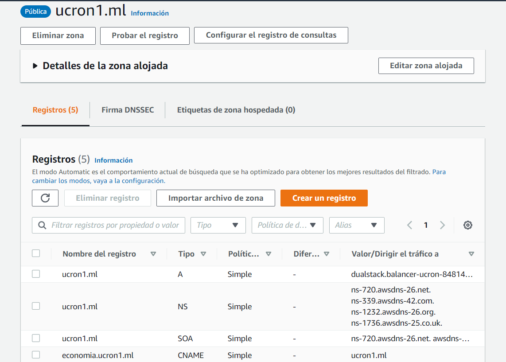

## Load Balancer
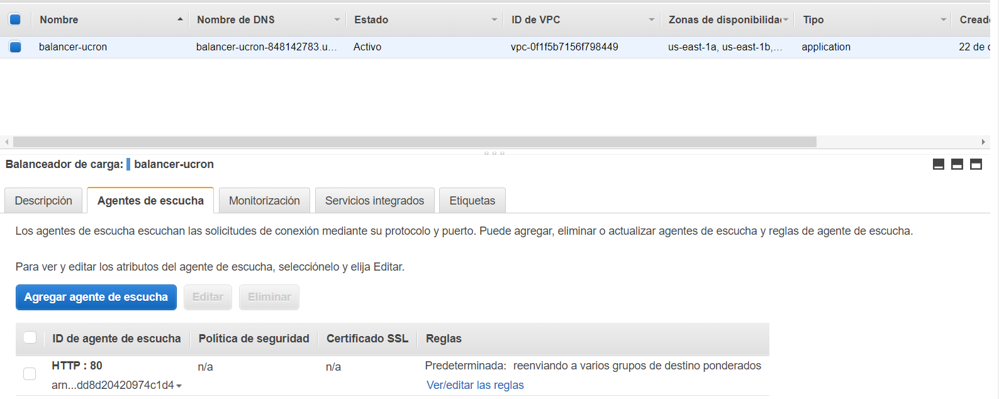

## Target Group
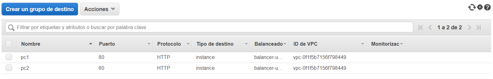


## Servidor

El servidor encargado de brindar los datos necesarios para ser utilizados en la aplicación web fue desarrollado con NodeJS, el cual se basa en la programación con el lenguaje de programación Javascript.

## Base de datos

Se utilizó la base de datos NoSQL, MongoDB, de tal forma que sea sencillo de registrar cada uno de los datos sin la necesidad de realizar consultas extensas que puedan afectar el rendimiento de toda la aplicación.

# Despliegue Aplicación

## Aplicación Web
Para el despliegue de la aplicación web se hizo uso del servidor Nginx, en el cual se montó el código generado por el comando build de ReactJS para que este sea su administrador y hacer los redireccionamientos necesarios hacia los demás dominios.

### Configuración Nginx
```sh
# ACTUALIZAR REPOSITORIOS
sudo apt update
sudo apt upgrade

# INSTALAR NGINX
sudo apt install nginx

# VER LA LISTA DE ALLOW
sudo ufw app list

# HABILITAR DE ALLOW
sudo ufw allow 'Nginx HTTP'
sudo ufw enable
systemctl status nginx

# BLOQUES DE DOMINIO

# PERMISOS Y CREACION DE CARPETA DOMINIO DESARROLLO ECONOMICO
sudo mkdir -p /var/www/economia.ucron1.ml/html
sudo chown -R $USER:$USER /var/www/economia.ucron1.ml/html
sudo chown -R 755 /var/www/economia.ucron1.ml

# PERMISOS Y CREACION DE CARPETA DOMINIO GENERAL
sudo mkdir -p /var/www/ucron1.ml/html
sudo chown -R $USER:$USER /var/www/ucron1.ml/html
sudo chown -R 755 /var/www/ucron1.ml

# PERMISOS Y CREACION DE CARPETA DOMINIO FUNCION PUBLICA
sudo mkdir -p /var/www/funcionpublica.ucron1.ml/html
sudo chown -R $USER:$USER /var/www/funcionpublica.ucron1.ml/html
sudo chown -R 755 /var/www/funcionpublica.ucron1.ml

# CREAR PAG HTML ESTATICA FUNCION PUBLICA
sudo cp index.html /var/www/funcionpublica.ucron1.ml/html/
sudo cp asset-manifest.json /var/www/funcionpublica.ucron1.ml/html/
sudo cp -r static /var/www/funcionpublica.ucron1.ml/html/

# CREAR PAG HTML ESTATICA DESARROLLO ECONOMICO
sudo cp index.html /var/www/economia.ucron1.ml/html/
sudo cp asset-manifest.json /var/www/economia.ucron1.ml/html/
sudo cp -r static /var/www/economia.ucron1.ml/html/

# CREAR PAG HTML ESTATICA HOME
sudo cp index.html /var/www/ucron1.ml/html/
sudo cp asset-manifest.json /var/www/ucron1.ml/html/
sudo cp -r static /var/www/ucron1.ml/html/

# CREAR ARCHIVO PARA HABILITAR EL SITIO ECONOMICO EN EL PUERTO 80
sudo nano /etc/nginx/sites-available/economia.ucron1.ml

# ESTRUCTURA ARCHIVO ECONOMICO
server {
        listen 80;
        listen [::]:80;

        root /var/www/economia.ucron1.ml/html;
        index index.html index.htm index.nginx-debian.html;

        server_name www.economia.ucron1.ml economia.ucron1.ml;

        location / {
                try_files $uri $uri/ =404;
        }
}

# CREAR ARCHIVO PARA HABILITAR EL SITIO FUNCION PUBLICA EN EL PUERTO 80
sudo nano /etc/nginx/sites-available/funcionpublica.ucron1.ml

# ESTRUCTURA ARCHIVO FUNCION PUBLICA
server {
        listen 80;
        listen [::]:80;

        root /var/www/funcionpublica.ucron1.ml/html;
        index index.html index.htm index.nginx-debian.html;

        server_name www.funcionpublica.ucron1.ml funcionpublica.ucron1.ml;

        location / {
                try_files $uri $uri/ =404;
        }
}

# CREAR ARCHIVO PARA HABILITAR EL SITIO HOME EN EL PUERTO 80
sudo nano /etc/nginx/sites-available/ucron1.ml

# ESTRUCTURA ARCHIVO HOME
server {
        listen 80;
        listen [::]:80;

        root /var/www/ucron1.ml/html;
        index index.html index.htm index.nginx-debian.html;

        server_name www.ucron1.ml ucron1.ml;

        location / {
                try_files $uri $uri/ =404;
        }
}

# HABILITAR EL SITIOS CREADOS
sudo ln -s /etc/nginx/sites-available/funcionpublica.ucron1.ml /etc/nginx/sites-enabled/
sudo ln -s /etc/nginx/sites-available/economia.ucron1.ml /etc/nginx/sites-enabled/
sudo ln -s /etc/nginx/sites-available/ucron1.ml /etc/nginx/sites-enabled/

# VERIFICAR ESTADISTICAS
sudo nginx -t

# REINICIAR NGINX PARA APLICAR CONFIGURACION
sudo systemctl restart nginx
```

## Servidor
Para el despliegue del servidor web se hizo uso del archivo [Dockerfile](./Backend/Dockerfile) para poder generar una imagen en [Docker Hub](https://hub.docker.com/) y sea más sencillo este despliegue, solamente con configurar las variables de entorno necesarias y ejecutar un comando se levanté todo automáticamente. 

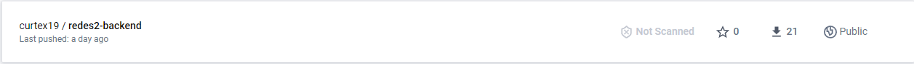

Se utilizó un archivo de docker-compose para que este sea el encargado de levantar cada uno de los respectivos componentes con su propia red y así poder ser administradas, el archivo tiene la siguiente estructura.

```yml
version: '3.9'

services:
  backend:
    image: curtex19/redes2-backend
    container_name: backend-proyecto
    ports: 
      - '8080:8080'
    environment:
      - HOST=localhost
      - PORT=8080
      - NAME="api-node"
      - adminMongo=admin-g8
      - passwordMongo=redes2-p
      - hostMongo=54.152.33.31
    networks:
      - proyecto
networks:
  proyecto:
    name: "proyecto"
    driver: bridge
```

## HTTPS

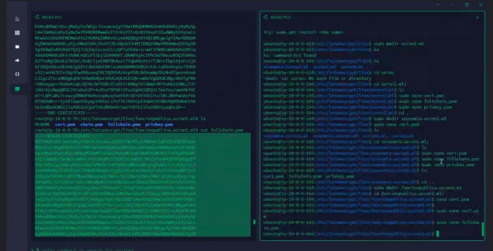


# Interfaz Gráfica 

## HOME
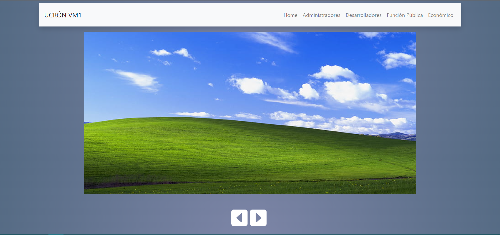

## ADMINISTRADOR


## DESARROLLADOR
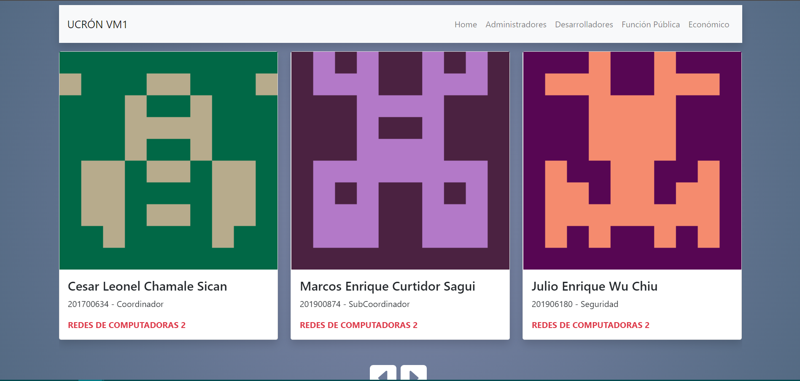

## FUNCION PUBLICA
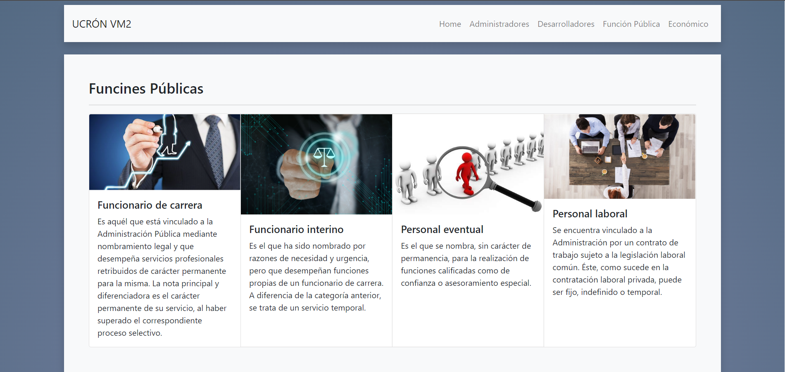

## ECONOMIA
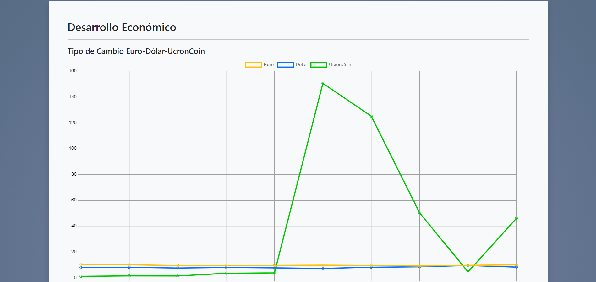
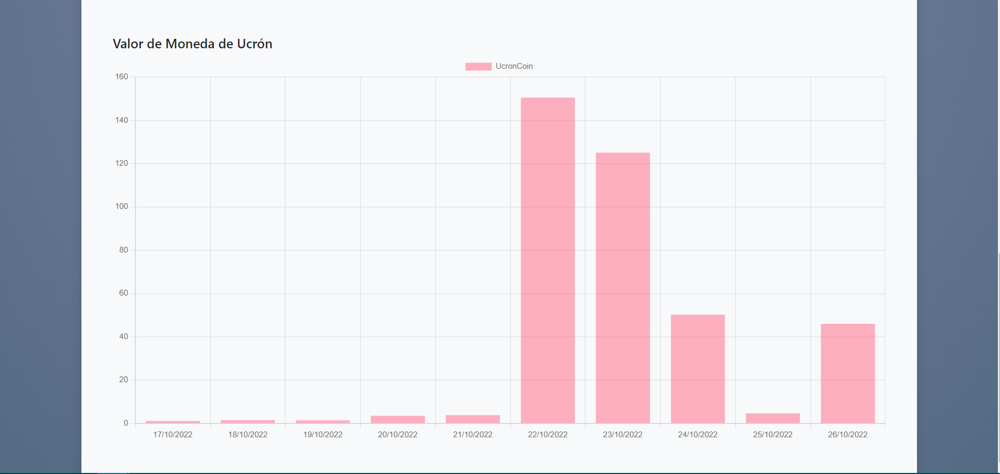
